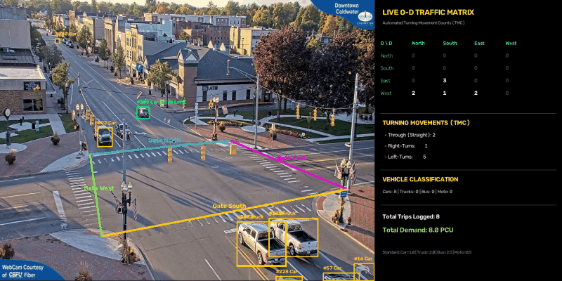

# 🚦 Automated Traffic Intersection Analysis (Gate-Based O-D Matrix)


<p align="center">
  
</p>

A professional-grade Computer Vision pipeline built to automate traffic data collection at complex intersections. This tool detects, tracks, and analyzes vehicle movements in real-time, generating Origin-Destination (O-D) matrices and Turning Movement Counts (TMC).

## 🌟 Key Engineering Features
* **Dual-Gate Logic (In/Out Zones):** Uses pixel-perfect, hardcoded polygon zones mapped exclusively to the asphalt. A vehicle is only counted if it passes through an `ENTRY` and `EXIT` gate.
* **ID Persistence:** Integrates a heavily buffered **ByteTrack** configuration (up to 30 seconds of memory). Vehicles stopped at red lights retain their tracking IDs.
* **Macro-Simulation Ready:** Automatically exports session data to CSV formats (PCU, TMC) ready for software like PTV Visum.

## 🛠️ How to Run
```bash
pip install -r requirements.txt
python main.py
